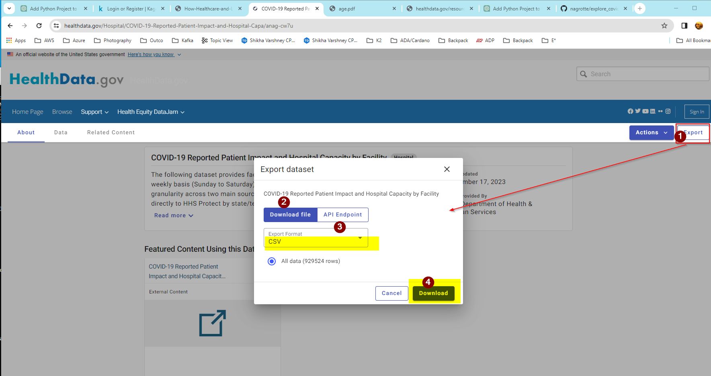

# Project Title

## Description

Describe your project briefly here.

## Installation

To run this project, you'll need Python and pip installed.

1. Clone this repository:
    ```bash
    git clone https://github.com/yourusername/your-repository.git
    ```

2. Navigate to the project directory:
    ```bash
    cd your-repository
    ```

3. Install dependencies:
    ```bash
    pip install -r requirements.txt
    ```

## Usage

1. Ensure you have completed the installation steps.
2. Run the application:
    ```bash
    python main.py
    ```

## Folder Structure

Your project folder structure should look like this:

explore_covid19/
├── src/
│ ├── data_loading.py
│ ├── data_analysis.py
│ ├── visualization.py
│ └── neural_network.py
├── data/
│ └── COVID-19_Reported_Patient_Impact_and_Hospital_Capacity_by_Facility.csv
├── main.py
├── README.md
└── requirements.txt

## COVID19 Data file 
download the covid 19 data file from here : https://healthdata.gov/Hospital/COVID-19-Reported-Patient-Impact-and-Hospital-Capa/anag-cw7u
click on EXPORT button you see on the top right hand corner of this page 
select CSV format and click download

place this file in your `data` as shown above
